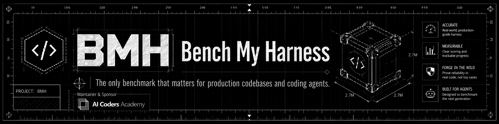

<p align="center">
  
</p>

# Bench My Harness

[](https://www.npmjs.com/package/bench-my-harness)
[](https://nodejs.org)
[](./LICENSE)

> Benchmark and observability harness for comparing agentic coding tools under controlled, repeatable conditions.

Bench My Harness (BMH) runs the same coding task against different agentic harnesses — **Codex** and **Claude Code** in v1 — captures what each one did, and turns the comparison into reproducible numbers: time, cost, tokens, and passing tests, side by side, with explicit source and confidence on every metric.

> **You tuned your agent setup: new skills, workflows, context, a different model. Did it actually get better, or does it just feel that way? Nobody measures. BMH does.** [Why →](#why-bmh)

## Table of Contents

- [Quickstart](#quickstart)
- [Prerequisites](#prerequisites)
- [Installation](#installation)
- [Why BMH](#why-bmh)
- [Core Concepts](#core-concepts)
- [Usage](#usage)
  - [Create or validate a benchmark](#create-or-validate-a-benchmark)
  - [Run a local dry run](#run-a-local-dry-run)
  - [Run Codex](#run-codex)
  - [Run Claude Code](#run-claude-code)
  - [Capture a hook event directly](#capture-a-hook-event-directly)
  - [Create a local spec catalog](#create-a-local-spec-catalog)
  - [Generate cases from Git history](#generate-cases-from-git-history)
  - [Validate and run a spec suite](#validate-and-run-a-spec-suite)
  - [Render a report](#render-a-report)
- [Command Reference](#command-reference)
- [Architecture](#architecture)
- [Roadmap](#roadmap)
- [Contributing](#contributing)
- [License](#license)

## Quickstart

### Getting Started

Get to a report in under a minute — no Codex or Claude Code credentials required. The `run --dry-run` command runs a one-trial suite against a built-in fake harness.

```bash
# 1. Install
npm install -g bench-my-harness

# 2. In a git repo, create a spec catalog
bmh init --repo-path . --test-command "npm test" --harness codex

# 3. Add one spec case (refs come from your git history)
bmh add ./prompt.md \
  --base-ref <commit-before-feature> \
  --golden-ref <commit-after-feature> \
  --include-in-suite

# 4. Run the fake-harness dry-run suite
bmh run --dry-run --run-id local_suite_001

# 5. Open the report
open .bmh/runs/local_suite_001/report.html
```

`report.html` is the main comparison artifact: harness rankings, duration/score/token/cost charts, observability coverage, artifact integrity, and source/confidence badges for every usage metric.

Once this works, swap in a real harness with [`bmh run --real`](#validate-and-run-a-spec-suite).

## Prerequisites

- **Node.js 22+** and npm.
- **git** — benchmarks check out a repository state per trial.
- **For `--real` runs only:** the `codex` and/or `claude` binaries on your `PATH`, valid credentials for each, and a disposable repository. Real runs let the selected harness edit a checkout, so never point them at a repo you care about. Real harness execution is opt-in and is never part of `npm test`.

## Installation

### From npm (recommended)

```bash
npm install -g bench-my-harness
bmh --help
```

This installs the `bmh` binary. All examples below use it.

### From source

```bash
git clone https://github.com/vinilana/bench-my-harness.git
cd bench-my-harness
npm install
npm run build
npm test
```

The built entrypoint is `./dist/adapters/inbound/cli/main.js`. If you have not installed the package globally, run any `bmh <args>` example as `node ./dist/adapters/inbound/cli/main.js <args>`.

## Why BMH

Everyone today is installing skills, doing spec-driven development, building workflows, testing models, stacking context.

**The annoying question: did it actually get better? Or does it just feel that way?**

Nobody measures. So I built a tool to measure it — Bench My Harness.

The decision is usually made on instinct and a stray screenshot. And the same gap shows up when teams adopt coding agents without reliable evidence about which harness performs best for their own repositories. Manual comparisons are noisy because every run can differ by prompt delivery, working directory, session history, permissions, context, model, hooks, and human timing. Two runs are never the same, so the conclusion collapses into guesswork.

BMH closes that gap. The loop is simple: measure your current setup, change **one** variable — a skill, a workflow, a context layer, the model — and measure again. The discussion stops being "I think it got better" and becomes time, cost, and passing tests, side by side.

**What BMH does:**

- Runs the same benchmark prompt against Codex and Claude Code.
- Automatically instruments each harness during the run with temporary, project-local hooks.
- Captures raw hook events and normalizes them into a versioned canonical event schema.
- Preserves transcripts, diffs, test results, tool usage, command execution, and artifacts.
- Captures token, cost, and context metrics from explicit usage sources when available.
- Marks every metric with its source and confidence.
- Refuses strong comparisons when data quality or harness capabilities are incompatible.

## Core Concepts

**Benchmark flow.** You define a benchmark (repository state, prompt, setup/validation commands, limits, expected outputs). For each trial BMH creates an isolated workspace, installs temporary hooks for the selected harness, injects run metadata via `BMH_*` environment variables, runs the harness non-interactively, persists raw and normalized events plus metric observations, collects transcripts/diffs/validation/usage/artifacts, removes the temporary hooks, and reports success, metrics, data quality, and comparability.

**Two observability sources.** Hooks alone can't capture everything, so BMH separates lifecycle/operational events (`HookIngestPort`) from token/cost/context usage (`UsageCapturePort`). Every metric carries `measurement_source`, `capture_source`, `confidence`, and a supporting event or artifact reference. When native cost is missing, BMH falls back to embedded pricing for explicitly supported known models and labels the value as estimated; unknown model variants stay unavailable rather than being priced by partial name matching.

**Trusted transcripts only.** BMH never scans provider session directories blindly. A provider-local transcript must be returned by the harness runner or referenced by a hook event, live under an approved Codex or Claude Code provider root, and pass lightweight trial-identity checks before usage capture trusts it.

See [`docs/adrs/`](./docs/adrs/) for the full design rationale, including [hexagonal architecture](./docs/adrs/001-hexagonal-architecture.md), [the canonical event schema](./docs/adrs/002-canonical-event-schema.md), [token measurement confidence](./docs/adrs/005-token-measurement-confidence.md), and [requiring multiple observability sources](./docs/adrs/013-observability-requires-multiple-sources.md).

## Usage

> Every `bmh` command below also works as `node ./dist/adapters/inbound/cli/main.js …` when running from a source build without a global install.

### Create or validate a benchmark

BMH uses a JSON-only v1 benchmark format. YAML benchmark files are rejected by validation and run commands; use `.json` fixtures until YAML parsing lands in a later version. For repository work, initialize a catalog and add one or more specs:

```bash
bmh init --repo-path . --test-command "npm test" --harness codex
bmh add ./docs/login-validation.md \
  --base-ref <commit-before-feature> \
  --golden-ref <commit-after-feature> \
  --include-in-suite
```

You can also add specs interactively:

```bash
bmh add
```

If you already have a standalone benchmark JSON file, validate it with `check`:

```bash
bmh check benchmarks/login-validation.benchmark.json
```

Interactive `bmh add` can detect setup and validation commands for supported local projects (e.g. `npm install`, `npm test`, `npm run typecheck`). Command generation is currently focused on Node.js projects; Python, Rust, Go, .NET, and Java/Kotlin detection is on the roadmap.

YAML benchmark files are intentionally rejected in v1.

### Run a local dry run

Dry-run mode verifies benchmark parsing, workspace creation, hook installation flow, and CLI output without launching Codex or Claude Code:

```bash
bmh run --benchmark benchmarks/login-validation.benchmark.json \
  --harness codex \
  --workspace-root .bmh/workspaces \
  --run-id run_local_001 \
  --trial-id codex_trial_1 \
  --dry-run
```

### Run Codex

Codex is supported through the `codex` harness id. For suite execution, `run --real --harness codex` uses the built-in Codex process profile:

```text
codex exec --skip-git-repo-check --sandbox workspace-write --dangerously-bypass-hook-trust -
```

The prompt is sent over stdin and `BMH_*` variables are injected. For one-off execution you may pass an explicit command:

```bash
bmh run --benchmark benchmarks/login-validation.benchmark.json \
  --harness codex \
  --workspace-root .bmh/workspaces \
  --run-id run_codex_001 \
  --trial-id codex_trial_1 \
  --harness-command-json '{"executable":"codex","args":[]}' \
  --run-validation
```

Codex usage capture is best effort. When a run artifact includes a Codex session transcript JSONL, BMH reports model, input/output/cached-input/total tokens, and estimated cost for explicitly supported OpenAI models. Cache-write tokens stay unavailable unless Codex exposes them.

OpenAI cost estimates default to Standard pricing. Set `BMH_OPENAI_PRICING_MODE=priority` to estimate with Priority pricing:

```bash
BMH_OPENAI_PRICING_MODE=priority bmh run --real --harness codex
```

During the run, BMH writes project-local Codex hook configuration inside the isolated trial workspace and points hooks at `bmh internal hook-capture --provider codex`.

### Run Claude Code

Claude Code is supported through the `claude_code` harness id. The process runner sends the prompt to stdin and injects `BMH_*` variables. Use `--harness-command-json` when your local `claude` command needs explicit arguments:

```bash
bmh run --benchmark benchmarks/login-validation.benchmark.json \
  --harness claude_code \
  --workspace-root .bmh/workspaces \
  --run-id run_claude_001 \
  --trial-id claude_trial_1 \
  --harness-command-json '{"executable":"claude","args":[]}' \
  --run-validation
```

Claude Code usage capture is best effort. When a run artifact includes a Claude transcript JSONL, BMH reports model, input/output/cache/total tokens, and cost. Cost is native when Claude provides `costUSD`; otherwise BMH estimates known Claude models from embedded pricing and marks the value as estimated.

During the run, BMH writes project-local Claude Code hook configuration inside the isolated trial workspace and points hooks at `bmh internal hook-capture --provider claude_code`.

### Capture a hook event directly

Harness hooks call `internal hook-capture` with one JSON event on stdin. This is useful for adapter debugging:

```bash
printf '{"hook_event_name":"PreToolUse","session_id":"debug","tool_name":"Bash"}' | \
  bmh internal hook-capture \
    --provider codex \
    --event PreToolUse \
    --run-id run_debug \
    --trial-id trial_debug \
    --event-source stdin \
    --spool .bmh/debug/events.jsonl
```

Use `--provider claude_code` for Claude Code hook payloads. In best-effort mode telemetry failures mark the trial with partial observability; in strict mode they fail the trial as `adapter_failed`.

### Create a local spec catalog

For repository-specific benchmark suites, create a catalog under `.bmh/specs`:

```bash
bmh init
```

Configure authoring defaults:

```bash
bmh init \
  --repo-path . \
  --category feature \
  --setup-command "npm install" \
  --test-command "npm test" \
  --harness codex \
  --harness claude_code \
  --trials 3 \
  --include-in-suite
```

This writes `.bmh/specs/suite.json`. To have a coding agent initialize the catalog for an existing repository, copy the prompt in [`docs/prompts/initialize-bmh-spec-catalog-prompt.md`](./docs/prompts/initialize-bmh-spec-catalog-prompt.md).

Then create feature specs from Markdown prompts. BMH infers the spec id from the file name and the display name from the first Markdown H1:

```bash
bmh add ./docs/login-validation.md \
  --base-ref <commit-before-feature> \
  --golden-ref <commit-after-feature>
```

Import multiple prompt files with the same refs:

```bash
bmh add "docs/specs/*.md" \
  --base-ref <commit-before-feature> \
  --golden-ref <commit-after-feature>
```

Each spec writes `.bmh/specs/cases/<spec-id>/spec.md` and `.bmh/specs/cases/<spec-id>/benchmark.json`.

### Generate cases from Git history

Prefer written spec cases when you have product requirements. When you don't, generate cases from historical repository changes:

```bash
bmh add --from-git \
  --id login-validation \
  --name "Login validation" \
  --category bugfix \
  --repo-path . \
  --base-ref <commit-before-feature> \
  --golden-ref <commit-after-feature> \
  --test-command "npm test" \
  --include-in-suite
```

BMH records changed files and commit evidence in `benchmark.json` metadata, but the default prompt avoids exposing commit refs or changed-file lists to the harness. Generated Git cases are a useful fallback; written cases remain the higher-quality signal.

To create multiple cases from a commit range (at most 25 by default; override with `--limit`):

```bash
bmh add --from-git --repo-path . --range main~25..main
```

For a single generated Git case, `--base-ref` and `--golden-ref` are required. `bmh add --from-git` is non-interactive in this mode: it does not prompt for missing refs, and it fails fast with an `add --from-git requires ...` message. Generated cases are not added to `suite.json` unless `--include-in-suite` is provided.

### Validate and run a spec suite

Validate the catalog and check local harness readiness:

```bash
bmh check
```

Run the suite against the fake harness (no credentials needed):

```bash
bmh run --dry-run --run-id local_suite_001
```

This writes:

```text
.bmh/runs/local_suite_001/results.json
.bmh/runs/local_suite_001/report.html
.bmh/runs/local_suite_001/specs/<spec-id>/<harness>/<trial-id>/result.json
```

Run real Codex or Claude Code as an explicit local workflow. Use it only in disposable workspaces or with reviewed specs, because the selected harness is allowed to edit the benchmark checkout:

```bash
bmh run \
  --real \
  --catalog-root .bmh/specs \
  --store-root .bmh/runs \
  --workspace-root .bmh/workspaces \
  --harness codex \
  --trials 1 \
  --run-id local_codex_real_001
```

Real suite runs create one git checkout per trial at the benchmark `repo.base_ref`, install project-local hooks inside that checkout, run the harness, execute validation commands, capture best-effort usage, and write `results.json`, `report.html`, and per-trial `result.json`, `process-stdout.txt`, `process-stderr.txt`, `process-exit.json`, `hooks.jsonl`, `usage.json`, and `artifact-index.json` under `.bmh/runs/<run-id>`.

### Render a report

Render a report JSON file directly:

```bash
bmh report --input report.json
```

Render a report stored at `.bmh/runs/<run-id>/report.json`:

```bash
bmh report --run-id run_codex_001 --store-root .bmh/runs
```

Render or re-render a suite HTML report (written to `.bmh/runs/<run-id>/report.html`):

```bash
bmh report --run-id local_suite_001 --store-root .bmh/runs --format html
```

## Command Reference

```bash
bmh internal hook-capture --provider codex --event PreToolUse --run-id <run-id> --trial-id <trial-id> --spool <path>
bmh init
bmh init --repo-path . --setup-command "npm install" --test-command "npm test" --harness codex --harness claude_code --include-in-suite
bmh add docs/specs/example.md --base-ref <base> --golden-ref <golden>
bmh add "docs/specs/*.md" --base-ref <base> --golden-ref <golden>
bmh add --from-git --repo-path . --base-ref <base> --golden-ref <golden>
bmh add --from-git --repo-path . --range main~25..main
bmh check
bmh run --dry-run --run-id local_suite_001 --harness codex --harness claude_code
bmh run --real --run-id local_codex_real_001 --harness codex --trials 1
bmh run --dry-run --run-id local_suite_001
bmh check benchmark.json
bmh run --benchmark benchmark.json --harness codex --dry-run
bmh run --benchmark benchmark.json --harness codex --harness-command-json '{"executable":"codex","args":[]}' --run-validation
bmh run --benchmark benchmark.json --harness claude_code --harness-command-json '{"executable":"claude","args":[]}' --run-validation
bmh report --input report.json
bmh report --run-id run_123 --store-root .bmh/runs
bmh report --run-id local_suite_001 --store-root .bmh/runs --format html
```

The v1 CLI accepts JSON benchmark files only. YAML is rejected by `check` and `run --benchmark`; use `.json` benchmark fixtures until YAML parsing lands in a later version.

## Architecture

BMH follows hexagonal architecture, built on TypeScript (Node.js 22+), Zod for runtime schemas and JSON contracts, Commander for the CLI, and Vitest for TDD. This stack optimizes for a CLI-first product that processes JSON hook payloads and validates versioned schemas; a native `hook-capture` binary can be introduced later if hook latency becomes a measured problem.

The **domain** owns benchmarks, runs and trials, raw hook events, normalized events, metric observations, capability matrices, comparability decisions, and artifacts. **Adapters** own Codex/Claude Code hook configuration, CLI commands, local hook capture, spool files, transcript import, usage capture, and filesystem storage. Core code must not import provider-specific packages or schemas directly — provider behavior belongs behind ports.

```text
src/
  domain/
  application/
  adapters/
    inbound/
    outbound/
tests/
  acceptance/
  integration/
  unit/
  fixtures/
docs/
  adrs/
  specs/
  prompts/
```

Design decisions are recorded as ADRs in [`docs/adrs/`](./docs/adrs/).

## Roadmap

### Roadmap Scope

The v1 foundation targets a local, reproducible benchmark workflow for Codex and Claude Code.

**Implemented in v1:**

- Codex and Claude Code adapter contracts.
- Automatic, per-trial temporary hook installation (project-local only).
- Raw hook event preservation and canonical normalization, with JSON/JSONL import and reprocessing.
- Versioned JSON benchmark validation and catalog storage.
- Multi-trial orchestration with isolated workspaces.
- Process-backed fake/local harness execution for tests and controlled runs.
- Validation command execution through a port-backed runner.
- Usage, metric, comparability, scoring, and report models with source/confidence.
- Best-effort usage capture for real Codex and Claude Code runs (model, token, cost, subagent, skill, MCP fields when sources expose them).
- Per-trial artifact finalization (`usage.json`, `artifact-index.json`, process diagnostics, hooks, transcripts, diffs, validation output).
- JSON and Markdown report export with redaction by default.
- Local HTTP ingest with HMAC, timestamp, nonce, provider, and payload-size checks.
- Local `.bmh/specs` catalogs built from written spec cases, plus generated Git cases as a fallback.
- Static redacted `report.html` for suite runs with filters, rankings, charts, usage coverage, artifact integrity, and harness comparison by time, cost, and token efficiency.

**Future phases:**

- Cursor, OpenCode, and Pi adapters.
- Distributed execution.
- Public leaderboard.
- Fine-tuning / model training workflows.
- Manual interactive benchmark mode (exploratory evidence, not a comparable result).
- Project command generation for Python, Rust, Go, .NET, and Java/Kotlin repositories.
- UI/dashboard, CSV export, and CI gates.

### Real Harness Smoke Tests

Real Codex and Claude Code smoke tests are local-only, opt-in checks for machines with the required binaries, credentials, and disposable workspaces. They must not run as part of `npm test`; the automated suite uses fake and process-controlled harnesses instead.

## Contributing

Development setup, test strategy, acceptance gates, and the build-phase plan live in [CONTRIBUTING.md](./CONTRIBUTING.md).

## License

[MIT](./LICENSE) © Vinicius Lana

---

<p align="center">
  Made in Brazil 🇧🇷 by Vini —
  <a href="https://www.youtube.com/@aicodersacademy">YouTube</a> ·
  <a href="https://www.linkedin.com/in/viniciuslanadepaula/">LinkedIn</a>
</p>
